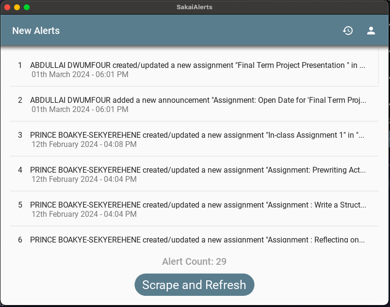

#  SakaiAlerts

## Introduction

This repository hosts an application designed to scrape and display alerts from the Sakai web portal. Sakai is a popular online learning and collaboration platform used by educational institutions.

## Purpose
The purpose of SakaiAlerts is to provide users with a convenient way to access and view alerts from the Sakai portal in a centralized application. By scraping the portal for alerts, users can stay informed about important announcements, assignments, or any other updates without manually checking the Sakai website.


## Setup Instructions

### Clone the Repository

```bash
git clone https://github.com/Programming-Sai/SakaiAlerts.git
```


### Inspection 

1. Navigate to the project directory.
2. Install the required dependencies by running the following command in the terminal:

```bash
pip install -r requirements.txt
```
This command will install all the dependencies specified in the requirements.txt file.
Make sure they have Python and pip installed on your system before running the command. 

3. Open the `main.py` file and run it. Avoid modifying the JSON files for credentials.

##


## Background Notification Feature

SakaiAlerts also includes a background notification feature to enhance user experience and keep them informed about important alerts even when the application is not actively open. This feature allows the application to run in the background and periodically check for new alerts on the Sakai portal. When new alerts are detected, users receive notifications, providing a seamless way to stay updated without manual intervention.

### How It Works

The background notification feature utilizes a separate Python script (`background_notify.py`) to periodically scrape the Sakai portal for new alerts. This script runs independently in the background, allowing users to continue their work without disruptions.


- The background notification process starts automatically when the main application is run.
- Users will receive notifications for new alerts even if the main application is closed.
- Ensure that the background script (`background_notify.py`) and (`credentials.json`) are not modified recklessly for the proper functioning of the background notification feature.


## Screenshots


#



#


#


#


#


#


#


#


#


#


#


#


#


## App Guidelines

### New Alerts Screen

- Click the "Scrape & Refresh" button to initiate the scraping process from the Sakai portal.
- Avoid opening alerts while scraping to prevent potential issues.
- If an error popup appears during scraping, ensure a stable internet connection. If the issue persists, re-enter login details. If still unsuccessful, manually edit the `credentials.json` file.


### Login Info Screen

- Enter login details carefully to avoid errors that may lead to scraping issues.
- If scraping fails, verify login details and, if necessary, update them in the `credentials.json` file.

